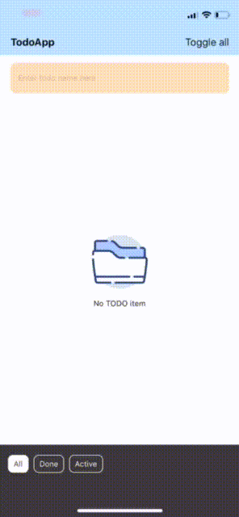

# TodoApp - DFO practical test ashkdlfjdsa
A TodoApp React Native assignment.

## 3rd-parties 
+ react-native-ionicons
+ react-native-iphone-x-helper
+ react-native-local-mongodb
+ react-native-swipeout
+ react-native-toast-native
+ prop-types
+ lodash

## What've I done?
+ TodoName textbox
+ Add and remove todoName (with animation - but improvement needed).
+ Beauty UI (base on my feeling, I use alot of pastel color)
+ Todo item switching between 2 state
+ Swipe to show delete option
+ Toggle all displayed todo items
+ Filter by item's status
+ Unit test for core logic

## What haven't I done (yet)?
+ Edit a Todo item
+ Store data on firebase
+ Get closer to unit testing
+ Improve UX

### Structure
For clearly,
+ components: contain every UI component use on overall app.
+ container: contain every container like todo list, filter bottom.
+ core: the core of application, handle and process todo list, store data in mongo local db, implement observe pattern to emit data realtime.
+ res: resource of application like strings, images
+ screens: contain home screen implemention class
+ utils: utilities use on overall app
+ AppProvider: using context API to provide a global state to every needed component.

### Test-case
All available testcase could be found [here](https://github.com/ducgao/dfo-practical-test/blob/master/__tests__/App-test.js)
